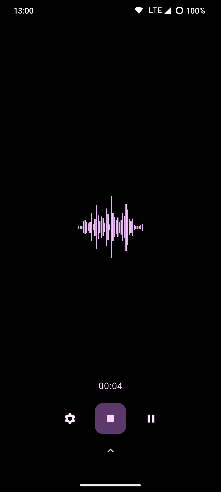
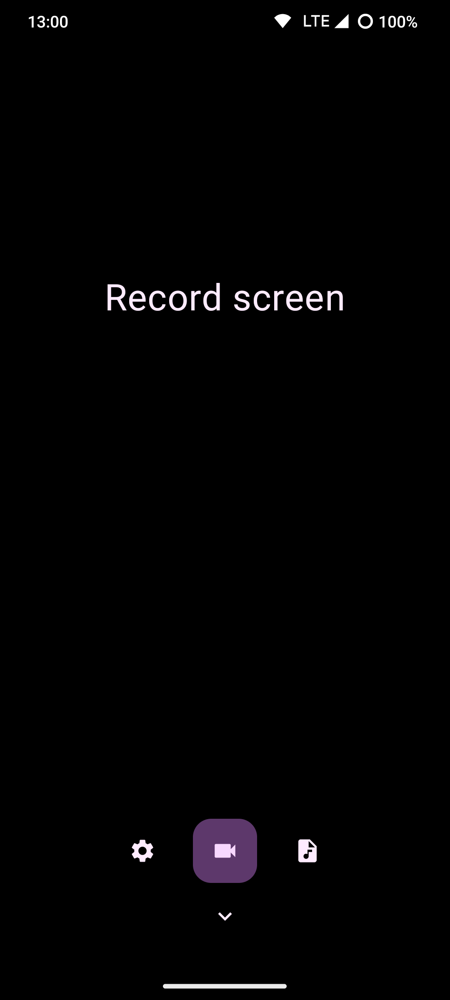
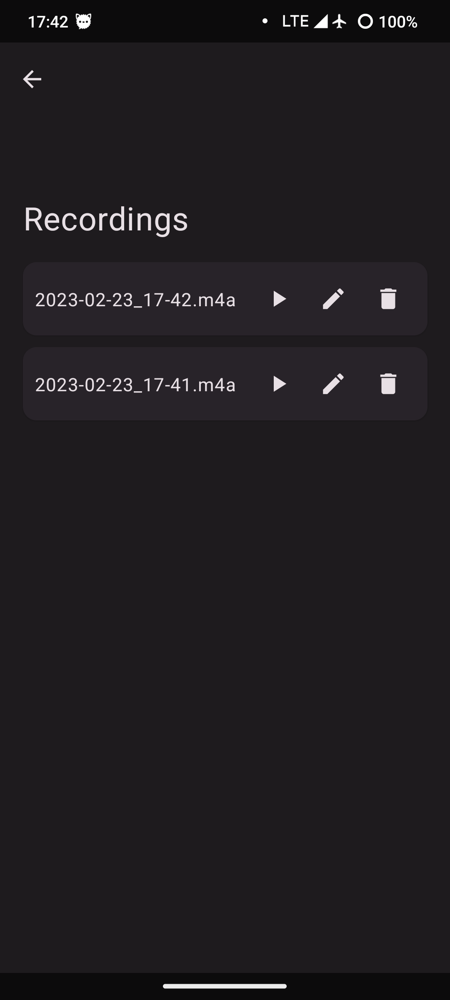
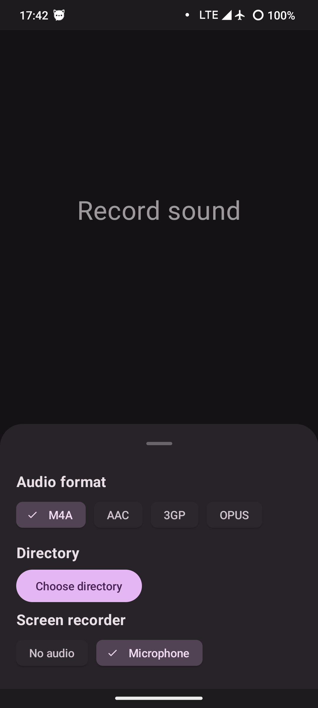

<!-- ---------- Header ---------- -->

  
  <h1>Record You</h1>

<a href="https://m3.material.io/">マテリアルデザイン3（You）</a> 音声およびスクリーンレコーダーアプリ

<!-- ---------- Badges ---------- -->
  

    
    
    
    
    
     

他の言語で読む：[英語](https://github.com/Bnyro/RecordYou/blob/main/README.md)

<!-- ---------- Description ---------- -->
## 特徴

- [x] マテリアルデザイン3（You）
- [x] ダークとライトのテーマ
- [X] 音声および画面録画のサポート
- [X] 利用可能な様々なフォーマットとコーデック
- [X] アプリ内録音プレーヤー
- [X] SAF（ストレージアクセスフレームワーク）のサポート
- [X] Jetpack Composeで書かれています 

<!-- ---------- Download ---------- -->
## Download

<!-- ---------- Screenshots ---------- -->
## Screenshots

  
    
  
  

<!-- ---------- Contribution ---------- -->
## フィードバックと貢献
***全ての貢献を歓迎します！***

* アプリについてのディスカッションについては、[マトリックス ルーム](https://matrix.to/#/#you-apps:matrix.org)にお気軽にご参加ください。
* バグレポートや機能リクエストは、[こちら](https://github.com/Bnyro/RecordYou/issues) から送信できます (要求された情報は全て正しく入力してください)。
* あなたが開発者で、アプリに貢献したい場合は、プロジェクトを**fork**し、[**pull request**](https://help.github.com/articles/about-pull-requests)を送信してください。

## 翻訳

## クレジット
* アイコンデザイン：[M00NJ](https://github.com/M00NJ)

## License

Record Youは [**GNU General Public License**](https://www.gnu.org/licenses/gpl.html) に基づいてライセンスが付与されています。必要に応じて使用、学習、共有できます。
