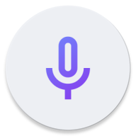

<!-- ---------- Header ---------- -->

  
  <h1>Record You</h1>

Modern voice recorder app using <a href="https://m3.material.io/">Material Design 3 (You)</a> and Jetpack Compose.

<!-- ---------- Badges ---------- -->
  

    
    
    
    
    
     

<!-- ---------- Description ---------- -->
## Features

- [x] Material Design 3 (You)
- [x] Dark and light theme
- [X] Different available formats and codecs
- [X] In-app recordings player
- [X] SAF (Storage Access Framework) support
- [X] Written in Jetpack Compose 

<!-- ---------- Download ---------- -->
## Download

## Translation

## License

Record You is licensed under the [**GNU General Public License**](https://www.gnu.org/licenses/gpl.html): You can use, study and share it as you want.
